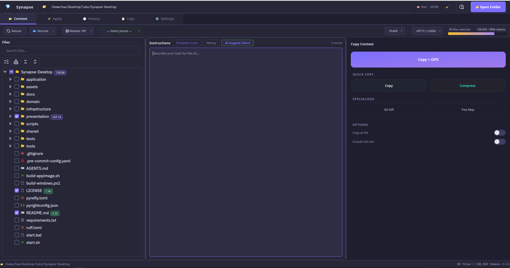
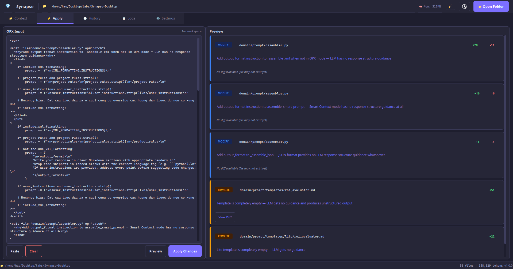
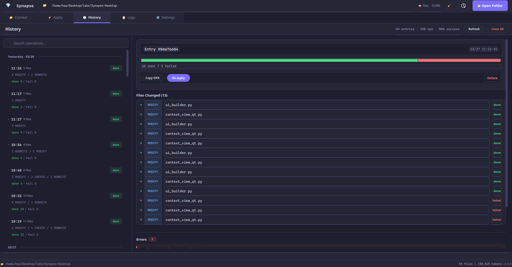
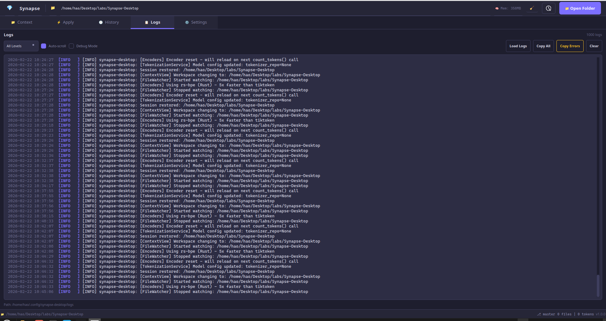

# Synapse Desktop


A desktop application for AI-assisted code editing:

- **Send Context**: Select files in your project → copy structured prompt → paste into ChatGPT/Claude/Gemini
- **Apply Changes**: Paste XML response from AI → view visual diff → apply to codebase with auto-backup

## Application Interface

**1. Context Management (Main Interface)**  

*Select files and view the calculated token count before copying the prompt.*

**2. Apply Changes (Apply Tab)**  

*Paste OPX XML from the AI and review visual diffs before confirming file overwrites.*

**3. Operation History (History Tab)**  

*Review the list of successful or failed apply/copy tasks.*

**4. System Logs (Logs Tab)**  

*View system events and debug information in the detailed Logs panel.*

**5. Settings (Settings Tab)**  

*Configure file rules, access permissions, and privacy options in the Settings tab.*

## Key Features

### Context Management
- **Tree selection**: Browse the directory tree and select files/folders to send.
- **Copy modes**:
  - `Context`: Full content of the files.
  - `Smart`: Only signatures/structures (reduces tokens by 70-80%).
  - `Diff Only`: Only git changes (for code review).

### Apply AI Changes
- **OPX format**: AI returns changes in structured XML format.
- **Visual diff**: Preview changes before applying.
- **Auto-backup**: Automatically backs up files before overwriting, allowing undo operations.

## Usage Workflow

1. **Select Context** (Context tab)
   - Open your project folder.
   - Check the required files.

2. **Copy to AI**
   - Click `Copy Context` or `Copy Smart`.
   - Paste into the AI chat and request the OPX format in return.

3. **Apply Changes** (Apply tab)
   - Copy the XML response from the AI.
   - Paste into the Apply tab → view diff → Apply.

## Installation

**Requirements**: Python 3.10+, Git (optional)

### Auto-script (Linux/macOS)
```bash
git clone https://github.com/HaoNgo232/Synapse-Desktop.git
cd Synapse-Desktop
chmod +x start.sh
./start.sh
```

### Manual Installation
```bash
# 1. Clone the repository
git clone https://github.com/HaoNgo232/Synapse-Desktop.git
cd Synapse-Desktop

# 2. Create a virtual environment
python -m venv .venv

# 3. Activate the venv
source .venv/bin/activate          # Linux/macOS
.\.venv\Scripts\Activate.ps1       # Windows

# 4. Install dependencies and run
pip install -r requirements.txt
python main_window.py
```

## OPX Format
Synapse uses OPX (Overwrite Patch XML) to describe file changes:

```xml
<edit file="src/app.py" op="patch">
  <find occurrence="first">
<<<
print("hello")
>>>
  </find>
  <put>
<<<
print("hello world")
>>>
  </put>
</edit>
```
Operations: `new` (create file), `patch` (find & replace), `replace` (overwrite completely), `remove` (delete), `move` (rename).

## Security and Privacy
- **Paths**: Prompts may contain absolute paths. Enable `Use Relative Paths` in Settings to protect your privacy.
- **Storage**: All data is stored locally at `~/.synapse-desktop/`.
- **Security scan**: Scans for API keys and passwords before copying (can be toggled on/off).

## Troubleshooting
- **"Module not found"**: Ensure your venv is activated and dependencies are installed.
```bash
source .venv/bin/activate
pip install -r requirements.txt
```
- **No data in Diff Only**: Ensure the project is a git repository and has changes.
```bash
git status
git diff
```
- **Apply failed "pattern not found"**: Ask the AI to provide a longer code block within the `<find>` tag.

## Acknowledgements

Inspired by:

- **[Repomix](https://github.com/yamadashy/repomix)** 
- **[Overwrite](https://github.com/mnismt/overwrite)** 
- **[PasteMax](https://github.com/kleneway/pastemax)** 

## License
MIT © HaoNgo232
