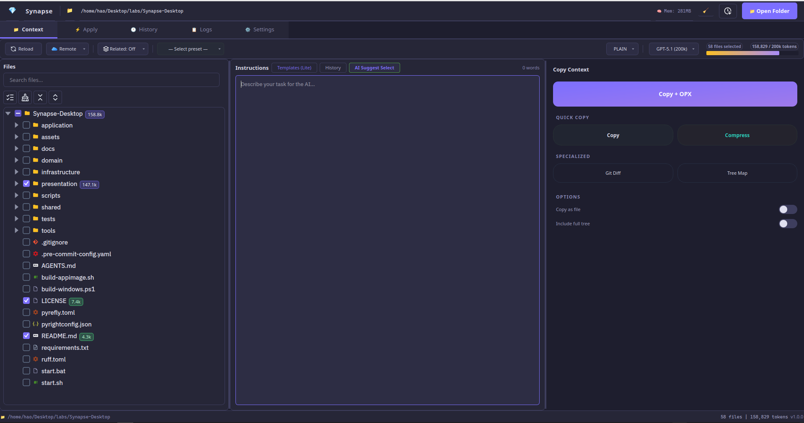
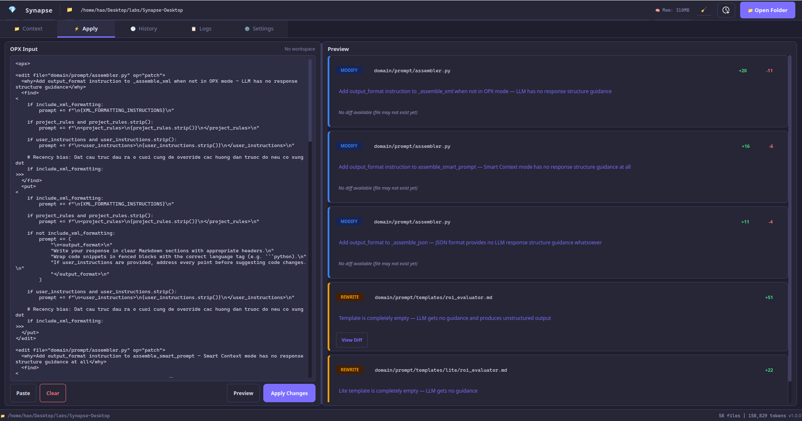
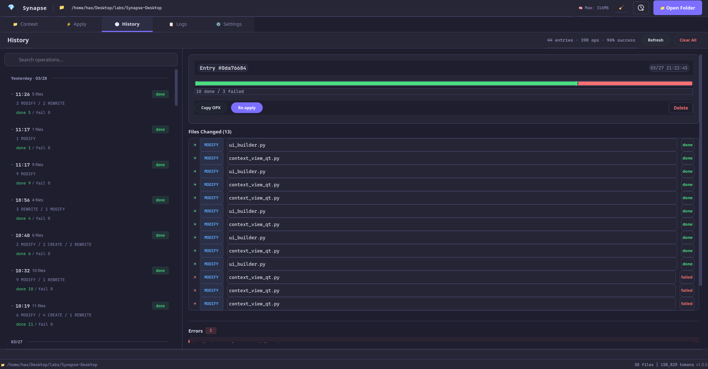
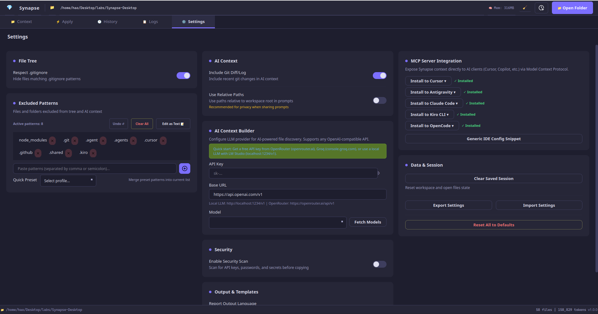

# Synapse Desktop


%20%7C%20Windows%20(Beta)-orange)
-41cd52)


A desktop application that bridges your codebase and AI assistants (ChatGPT, Claude, Gemini, or any OpenAI-compatible API). Synapse Desktop lets you select files from a project tree, package them into structured prompts with accurate token counts, and then apply AI-generated code changes back to your codebase — all with visual diffs, auto-backup, and continuous memory across sessions.

**Now supports Model Context Protocol (MCP):** Run Synapse as a headless server to expose your workspace directly to AI clients (Cursor, GitHub Copilot, Claude Code, Antigravity, Kiro CLI, OpenCode) via standardized tools, enabling seamless AI-codebase integration without manual copy/paste workflows.

**Agent Skills Workflows:** Synapse includes 7 pre-built workflow skills (rp_build, rp_review, rp_refactor, rp_investigate, rp_test, rp_export_context, rp_design) that can be auto-installed to AI IDEs, providing structured multi-step workflows for complex coding tasks.

> ⚠️ **Platform Status:** Currently stable on **Linux**. The **Windows** version is in experimental/beta phase. **macOS** is currently unsupported/untested due to lack of testing environments.

---

## 🌟 Why Use Synapse?
When working with LLMs for coding, managing context is a massive pain. Copy-pasting multiple files is tedious, and guessing token counts leads to truncated responses. Applying the AI's response back to your codebase is equally risky. 

**Synapse solves this by providing:**
- **Smart Context Packaging:** Select files in your project → copy a structured prompt with exact token counts → paste into ChatGPT / Claude.
- **AST Optimization:** Use "Smart Copy" to extract only function signatures and class definitions from code, saving 70-80% of your token budget while giving the AI the big picture.
- **Safe Code Application:** Paste XML responses (OPX format) from the AI → view visual diffs → apply to codebase with seamless auto-backup.
- **Autonomous Exploration (MCP Mode):** Let your AI Editors (Cursor, Copilot, etc.) use Synapse's advanced AST tools, token counting, and dependency graphs natively.
- **Structured Workflows (Skills System):** Install pre-built multi-step workflows to your IDE that guide AI agents through complex tasks like code review, refactoring, and bug investigation.

---

## ✨ Key Features

### Context Management
- **Tree selection**: Browse the directory tree and select files/folders to send.
- **Copy modes**:
  - `Context`: Full content of the files.
  - `Smart`: Only signatures/structures (reduces tokens by 70–80%).
  - `Diff Only`: Only git changes (for code review).
- **Context Presets**: Save and restore file selections with instructions for recurring tasks. Quick access via dropdown or `Ctrl+Shift+S` shortcut. [Learn more](docs/PRESETS.md)
- **AI Suggest Select**: Write your instructions, and a connected LLM automatically selects the most relevant files from the tree.
- **Prompt Templates**: Built-in and custom templates for common tasks (bug hunting, refactoring, security audit, etc.).
- **Related Files**: Automatically discover and include files that import or are imported by your selection.
- **Content Search**: Search file contents directly from the tree search bar using `code:` prefix (e.g., `code:def main`).

### Apply AI Changes
- **OPX format**: AI returns changes in structured XML format.
- **Visual diff**: Preview changes before applying.
- **Auto-backup**: Automatically backs up files before overwriting, allowing undo operations.
- **Continuous Memory**: AI summarizes its actions; Synapse saves this to `.synapse/memory.xml` and injects it into future prompts for multi-session continuity.
- **Error Context**: One-click "Copy Error Context" provides the AI with detailed diagnostics (file content, search pattern, OPX instruction) for self-repair.

### MCP Server Integration (IDE Backend for AI Agents)
- **Direct AI Access**: Run Synapse as an MCP server to expose specialized workspace analysis tools directly to AI clients.
- **Auto-Detection**: Workspace path is automatically detected from MCP Context roots (no manual configuration needed).
- **21 Comprehensive Tools**: Provides a suite of tools categorized for optimal usage by AI agents.

  **Workflow Tools (NEW)**
  *Advanced multi-step workflows for AI agent handoff:*
  - `rp_build` — Context Builder: Auto-detect scope, optimize token budget, generate handoff prompt
  - `rp_design` — Architectural Design Planner: Produce an architectural design and implementation plan based on task requirements
  - `rp_review` — Code Review: Deep review with surrounding context (imports, callers, tests)
  - `rp_refactor` — Two-Pass Refactor: Analyze first (discover), then plan (safe refactoring)
  - `rp_investigate` — Bug Investigation: Trace execution path from error traces
  - `rp_test` — Test Generation: Analyze code to identify coverage gaps and prepare context for writing missing tests
  - `rp_export_context` — Oracle Export: Build context and export to file for manual handoff to external LLMs (ChatGPT, Claude Web)
  
  [📖 Workflow Tools Documentation](docs/WORKFLOW_TOOLS.md)

  **Advanced Tools**
  *Tools providing capabilities like AST parsing and accurate token counting:*
  - `start_session` — Project discovery (structure + tree + todos).
  - `explain_architecture` — High-level architecture summary based on file and module analysis.
  - `get_codemap` — Extract AST code structure (function/class signatures only).
  - `batch_codemap` — Mass extract code structures for all code files in a directory.
  - `get_symbols` — Structured JSON symbol list for programmatic analysis.
  - `estimate_tokens` — Accurate LLM token counting using proper tokenizers.
  - `get_imports_graph` — Cross-file dependency graph resolution.
  - `get_related_tests` — Discovery of test files corresponding to source files.
  - `blast_radius` — Assess impact of changes on dependent modules.
  - `detect_design_drift` — Compare planned vs actual changes and detect structural drift.
  - `get_contract_pack` — Check existing constraints, conventions, and anti-patterns for AI compliance.
  - `build_prompt` — Package files into a structured prompt format (Ideal for Cross-Agent Delegation).
  - `manage_selection` — Track selected files for context building.
  - `manage_memory` — Manage cross-session AI interaction memory and guidelines.

  *Note: For basic file reading, directory listing, and text search, AI clients should utilize their built-in native tools as they have lower overhead.*

- **Auto-Configuration**: One-click installation of MCP config files via Settings tab (supports Cursor, VS Code, Claude Code, Antigravity, Kiro CLI, OpenCode). Auto-updates command paths when binary is moved (AppImage/exe builds).
- **Headless Operation**: No GUI overhead when running in MCP mode — pure stdio transport for maximum efficiency.

---

## 🚀 Usage Workflow

### 1. Standard GUI Workflow (Copy-Paste)
1. **Select Context**: Open your project folder. Check the required files in the tree. Token counts update in real time.
2. **Copy to AI**: Click **Copy Context**, **Copy Smart**, or **Copy Diff Only**. Paste into the AI chat and request the OPX format in return.
3. **Apply Changes**: Copy the XML response from the AI. Paste into the Apply tab → **Preview** → review diffs → **Apply Changes**.

### 2. MCP Server Workflow (Autonomous)
1. **Setup MCP Integration** (Settings → MCP Server Integration). Click **Install to Cursor** (or your preferred AI client).
2. **Use AI Client**: Open your AI client. Synapse tools are now available directly in AI conversations. Example: *"Use `start_session` to analyze this codebase."*
3. **AI Explores Autonomously**: The AI client spawns Synapse in headless mode (`--run-mcp`). No manual copy/paste—the AI uses Synapse's advanced AST and dependency parsing natively.
4. **Cross-Agent Delegation (Pro Tip)**: Ask your Planning Agent to use the `build_prompt` tool to generate a `spec.xml` file containing the full project architecture. Then, tell your Coding Agent to read that file. This transfers massive context between AI agents efficiently without crashing the chat window!

### 3. Skills-Based Workflow (Structured Multi-Step)
1. **Install Skills** (Settings → Skills System → Install to [IDE]).
2. **Invoke Skill**: In your AI client, reference the skill name (e.g., "Use rp_build to prepare context for adding rate limiting").
3. **AI Follows Workflow**: The AI agent automatically executes the multi-step workflow defined in the skill, calling Synapse MCP tools in the correct sequence.
4. **Review Results**: The AI presents the final context package or analysis for your review.

*(Manual MCP Server Launch: `python main_window.py --run-mcp /path/to/workspace`)*

---

## 🖥️ Application Interface

**1. Context Management (Main Interface)**

*Select files and view the calculated token count before copying the prompt.*

**2. Apply Changes (Apply Tab)**

*Paste OPX XML from the AI and review visual diffs before confirming file overwrites.*

**3. Operation History (History Tab)**

*Review the list of successful or failed apply/copy tasks.*

**4. Settings (Settings Tab)**

*Configure file rules, access permissions, privacy options, and MCP Server Integration.*

---

## ⚙️ Installation & Configuration

### Prerequisites
Python 3.10+, Git (optional, for branch detection and diff context).

### Quick Start
**Linux (Stable)**
```bash
git clone https://github.com/HaoNgo232/Synapse-Desktop.git
cd Synapse-Desktop
chmod +x start.sh
./start.sh
```

**Windows (Experimental)**
Double-click `start.bat`, or use `build-windows.ps1` to compile into a `.exe`.

**Building AppImage (Linux)**
To build a standalone executable AppImage for Linux, run the included script:
```bash
chmod +x build-appimage.sh
./build-appimage.sh
```

### Manual Installation
```bash
git clone https://github.com/HaoNgo232/Synapse-Desktop.git
cd Synapse-Desktop
python -m venv .venv
source .venv/bin/activate  # Or .\.venv\Scripts\Activate.ps1 on Windows
pip install -r requirements.txt
python main_window.py
```

### Configuration Data
Synapse stores all data locally at `~/.config/synapse-desktop/` (Linux) or `~/.synapse-desktop/` (Windows). No telemetry is collected.
Contains: `settings.json`, `session.json`, `history.json`, `recent_folders.json`, `logs/`, and `backups/`.

### Environment Variables
<!-- ADDED: Environment Variables configuration section -->
- `SYNAPSE_DEBUG=1`: Run the application with verbose debug logging to standard output. Useful for troubleshooting MCP connections and internal errors.

---

## 🔧 OPX Format & Continuous Memory

**OPX (Overwrite Patch XML)**
Synapse expects AI to return changes in this structured XML format:
```xml
<edit file="src/app.py" op="patch">
  <find occurrence="first">
<<<
print("hello")
>>>
  </find>
  <put>
<<<
print("hello world")
>>>
  </put>
</edit>
```
Operations supported: `new`, `patch`, `replace`, `remove`, `move`.

**AI Continuous Memory**
When enabled in Settings, the AI is instructed to include a `<synapse_memory>` block summarizing its actions. Synapse saves the last 5 memory blocks to `.synapse/memory.xml` in your workspace and automatically injects them into subsequent prompts, giving the AI long-term memory across sessions.

---

## 🛡️ Security and Privacy

- **Local Only**: All settings and context data are processed locally. No external telemetry.
- **Relative Paths**: Enable **Use Relative Paths** in Settings to obfuscate your local machine directory names structure.
- **Secret Scanning**: Synapse pre-scans selected files for API keys and passwords before copying context.
- **MCP Security**: Runs via local `stdio` UNIX sockets. Validates all file paths strictly to prevent directory traversal attacks.

---

## 🛠️ Troubleshooting

- **"Module not found"**: Ensure your venv is activated (`source .venv/bin/activate`) and run `pip install -r requirements.txt`.
- **Apply failed "pattern not found"**: Ask the AI to provide a longer, more unique code block within the `<find>` tag.
- **Cascade failures during Apply**: If multiple edits target the exact same file, block 1 might change the text that block 2 is trying to `<find>`. Use **Copy Error Context** to give the AI context so it can rewrite the OPX.
- **Slow directory scanning**: Install `scandir-rs` (`pip install scandir-rs`) for 3–70x faster scanning.
### MCP-Specific Issues

**MCP Connection Timeout ("context deadline exceeded")**
- **Cause**: MCP client (Cursor/Copilot) expects handshake within 5-10 seconds, but Synapse is slow to start.
- **Solution 1**: Test manually: `python main_window.py --run-mcp /path/to/workspace`. If it hangs or shows Python errors, fix those first.
- **Solution 2**: Check MCP config file (e.g., `~/.cursor/mcp.json`). Ensure `command` points to correct Python executable and `main_window.py` path.
- **Solution 3**: If using AppImage, ensure `APPIMAGE` environment variable is set correctly. Run `echo $APPIMAGE` to verify.

**MCP Tools Not Appearing in AI Client**
- **Cause**: MCP server failed to start or crashed during initialization.
- **Solution**: Check stderr logs. MCP server logs to stderr by default. Run `python main_window.py --run-mcp /path/to/workspace 2> mcp_error.log` to capture errors.

**Auto-Detection Not Working**
- **Cause**: AI client doesn't expose workspace roots via MCP Context.
- **Solution**: Manually pass `workspace_path` parameter to tools. Example: `get_project_structure(workspace_path="/home/user/project")`.

**Skills Not Appearing in IDE**
- **Cause**: Skills not installed or IDE doesn't support Agent Skills standard.
- **Solution**: Go to Settings → Skills System → Install to [IDE]. Verify installation path (e.g., `~/.cursor/skills/rp_build/SKILL.md`).

**Skill Execution Fails**
- **Cause**: AI agent doesn't have access to required MCP tools.
- **Solution**: Ensure MCP server is running and all tools are registered. Run `start_session()` first to verify connectivity.

---

## 🏗️ Architecture & Contributing (Under the Hood)

This section is intended for developers who wish to understand or contribute to the Synapse Codebase.

### Tech Stack
- **GUI**: PySide6 (Qt 6)
- **Tokenization**: tiktoken / HuggingFace tokenizers
- **Protocol**: MCP (Model Context Protocol) via `FastMCP`
- **Fast I/O**: scandir-rs (optional)

### Key Design Decisions
- **PySide6 over Electron**: Much lower memory footprint and faster startup.
- **Mixin UI Pattern**: `ContextViewQt` composes behavior from focused Mixin modules (`UIBuilderMixin`, `CopyActionsMixin`, etc.).
- **Service Container**: Pure dependency injection via `ServiceContainer` instead of massive global singletons.
- **Thread-safe**: Aggressive use of global cancellation flags, `threading.Lock`, and `SignalBridge` for pushing background updates to the main thread securely.
- **Skills as Markdown**: Workflow definitions stored as `.md` files for easy editing without touching Python code.

### Key Modules
- `main_window.py`: Entry point for GUI and MCP mode.
- `presentation/`: Qt UI modules, themes, and presentation logic (`views`, `components`, `config`).
- `application/`: Application layer connecting UI with domain logic (`session`, `settings`, `history`).
- `domain/`: Core business logic (`prompt`, `tokenization`, `smart_context`, `drift`, `contracts`).
- `infrastructure/mcp/`: FastMCP implementation (`server.py`, `config_installer.py`, `skill_installer.py`).
- `infrastructure/mcp/handlers/`: MCP tools and handlers (workspace, file, selection, git, analysis).
- `infrastructure/mcp/skills/`: 7 workflow skill definitions (Markdown files).
- `domain/workflow/`: Advanced workflow implementations (`context_builder`, `code_reviewer`, `bug_investigator`, `refactor_workflow`, `test_builder`).

### Development Guidelines
<!-- UPDATED: Added comprehensive development guidelines from AGENTS.md -->
- **Code Style (SOLID & DDD)**: Strict adherence to Domain-Driven Design (DDD) principles separating `domain`, `application`, `infrastructure` and `presentation`. Follow SOLID principles.
- **Type Hints**: Fully typed codebase required. We use `pyrefly` in strict mode to enforce typing.
- **Testing**: 
  - Standard test run: `pytest tests/ -v`
  - Focus on individual files when iterating: `pytest tests/test_token_counter.py -v`
- **Linting & Formatting**: Handled via `ruff` (`ruff format .` and `ruff check --fix .`). Unused imports/vars checked explicitly.
- **UI Thread Safety**: Never update PySide6 UI directly from background threads. Use `SignalBridge`, `run_on_main_thread()`, or `schedule_background()` from `qt_utils` for async operations.
- **Naming Conventions**: `PascalCase` for Classes, `snake_case` for functions/variables, `UPPER_SNAKE_CASE` for constants. Prefix private methods with an underscore (`_method`).

---

## Acknowledgements
Inspired by:
- [Repomix](https://github.com/yamadashy/repomix) (MIT License) - File packaging and token counting concepts
- [Overwrite](https://github.com/mnismt/overwrite) (MIT License) - OPX format for structured code changes
- [PasteMax](https://github.com/kleneway/pastemax) (MIT License) - Context management workflow ideas
- Workflow tool concepts for AI-assisted code analysis inspired by [RepoPrompt](https://repoprompt.com) and similar patterns in the AI tooling ecosystem

## License
<!-- UPDATED: Changed license from MIT to GPL-3.0 as requested -->
[GPL-3.0 License](LICENSE) © HaoNgo232

---
*Note: This documentation was automatically analyzed and updated to reflect the latest Synapse Desktop structural decisions.*
