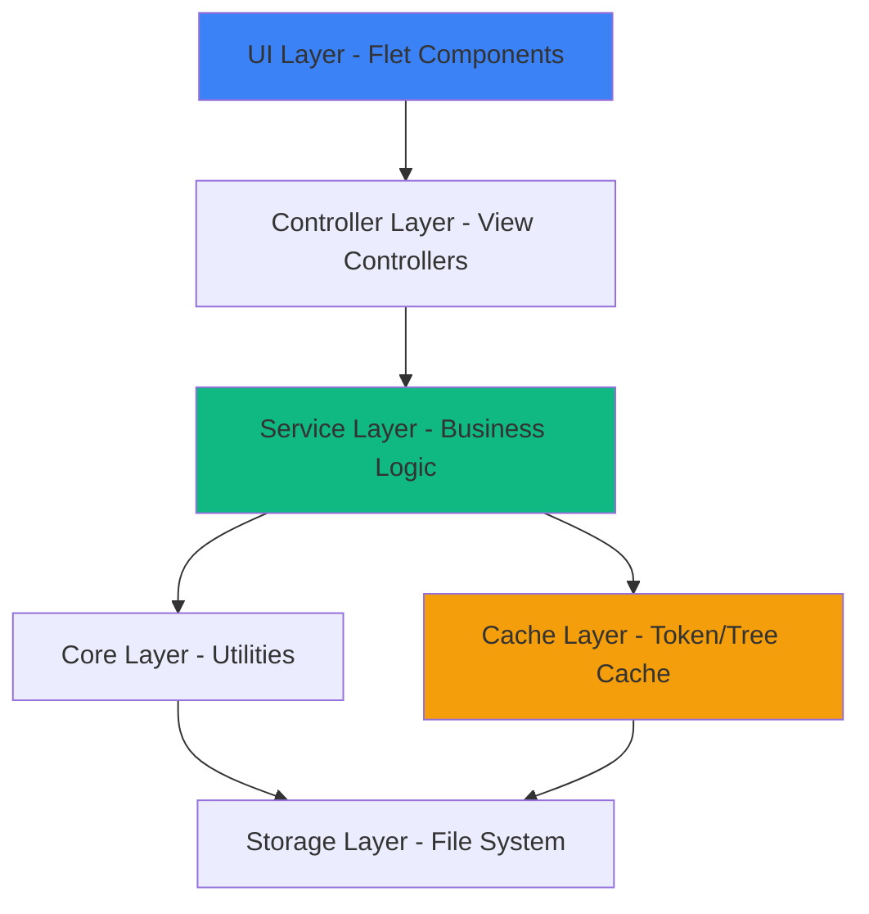
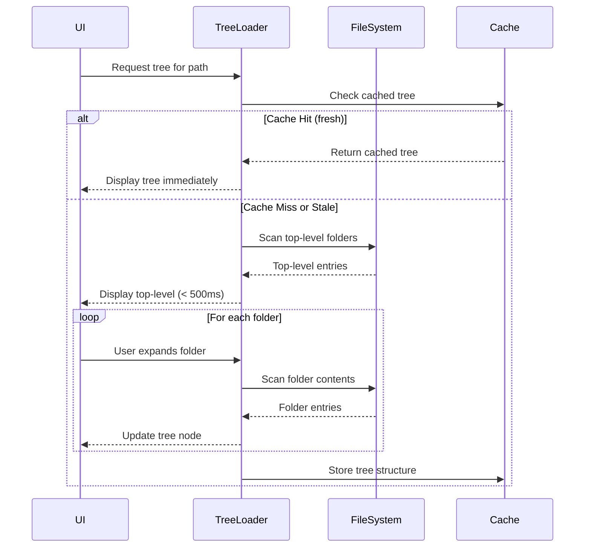
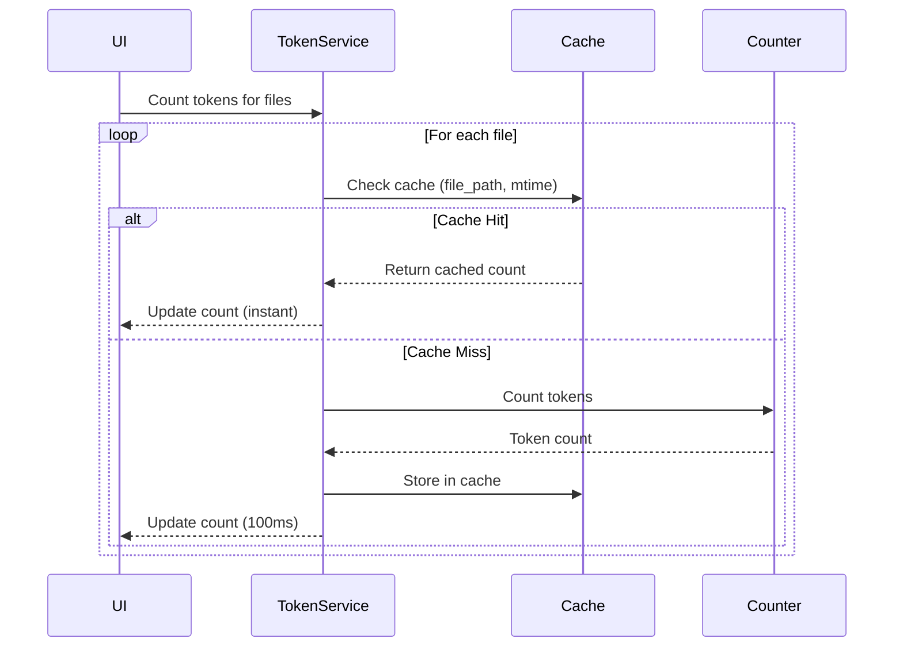
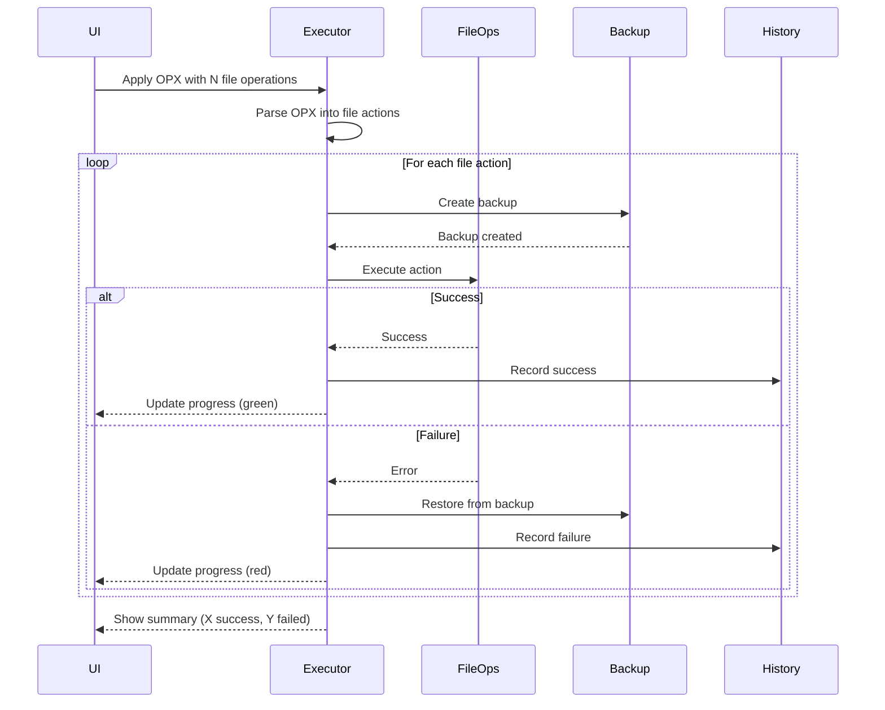
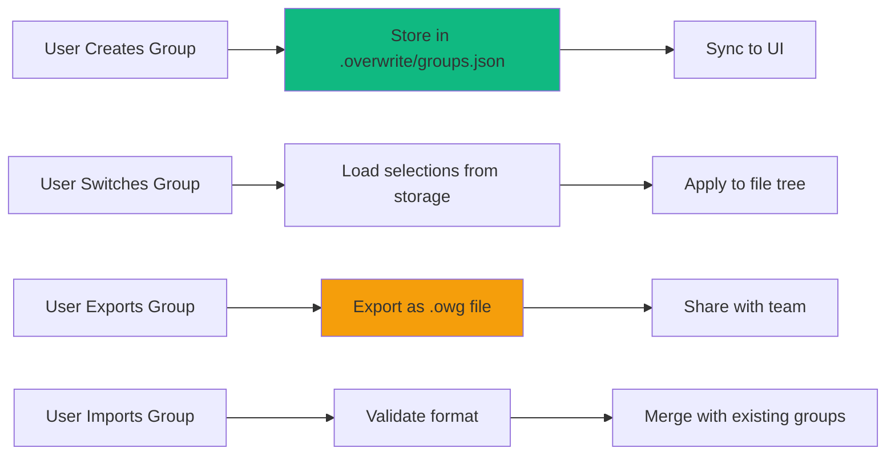

# Large Codebase Features - Architecture & Design

## Architecture Overview

The design follows a layered architecture with clear separation of concerns:



### Key Components

1. **Incremental Tree Loader**
   - Loads file tree progressively
   - Background thread for non-blocking I/O
   - Event-based updates to UI

2. **Token Cache Manager**
   - SQLite-based persistent cache
   - Hash-based invalidation
   - Memory-aware cache eviction

3. **Selection Group Manager**
   - Project-local storage (`.overwrite/`)
   - Import/export for sharing
   - Versioned format for compatibility

4. **Partial Operations Executor**
   - Independent file operation execution
   - Transaction-like rollback per file
   - Detailed error reporting

5. **Smart Selection Engine**
   - Pattern matching (glob, regex)
   - Git integration (status-based selection)
   - Composite filters

## Data Flow Diagrams

### Incremental Tree Loading Flow



### Token Counting with Cache



### Partial OPX Application Flow



### Selection Group Management



## Component Design

### 1. Incremental Tree Loader

```python
@dataclass
class TreeLoadState:
    """Track loading state of tree"""
    path: str
    loaded_depth: int = 0
    total_folders: int = 0
    loaded_folders: int = 0
    is_complete: bool = False

class IncrementalTreeLoader:
    """
    Load file tree incrementally to avoid blocking UI.
    
    Features:
    - Top-level load within 500ms
    - Lazy-load subdirectories on expansion
    - Progress callback for UI updates
    - Cancellation support
    """
    
    def __init__(
        self,
        root_path: Path,
        excluded_patterns: list[str],
        use_gitignore: bool,
        on_progress: Callable[[TreeLoadState], None]
    ):
        self._root = root_path
        self._excluded = excluded_patterns
        self._use_gitignore = use_gitignore
        self._on_progress = on_progress
        self._state = TreeLoadState(path=str(root_path))
        self._cancelled = False
        
    def load_top_level(self) -> TreeItem:
        """Load only top-level folders (fast)"""
        # Implementation: scan depth=1 only
        
    def load_folder(self, folder_path: str) -> list[TreeItem]:
        """Load specific folder on-demand"""
        # Implementation: scan single folder
        
    def load_full_async(self) -> None:
        """Background load full tree"""
        # Implementation: breadth-first scan with callbacks
        
    def cancel(self) -> None:
        """Cancel ongoing load operation"""
        self._cancelled = True
```

**Performance Targets:**
- Top-level load: < 500ms for any project
- Folder expansion: < 100ms for typical folder
- Memory overhead: < 1MB per 1000 files

**Fallback Strategy:**
- If scan takes > 10s, stop and show partial tree
- If memory > 800MB, stop loading
- If permission errors, skip inaccessible folders

### 2. Token Cache Manager

```python
@dataclass
class CacheEntry:
    """Cached token count entry"""
    file_path: str
    content_hash: str  # SHA-256 of file content
    token_count: int
    last_updated: float  # Unix timestamp
    encoding_model: str  # e.g., "cl100k_base"

class TokenCacheManager:
    """
    Persistent cache for token counts.
    
    Features:
    - SQLite storage for fast lookup
    - Hash-based invalidation
    - Memory-aware cache size limits
    - Auto-cleanup of stale entries
    """
    
    def __init__(self, cache_dir: Path, max_size_mb: int = 100):
        self._db_path = cache_dir / "token_cache.db"
        self._max_size = max_size_mb
        self._init_database()
        
    def get(self, file_path: Path) -> Optional[int]:
        """Get cached count if valid"""
        # 1. Check file mtime
        # 2. If unchanged, return cached count
        # 3. If changed, return None (invalidate)
        
    def set(self, file_path: Path, count: int, content_hash: str):
        """Store token count in cache"""
        # 1. Insert or update entry
        # 2. Check total cache size
        # 3. Evict old entries if needed
        
    def invalidate(self, file_path: Path):
        """Remove entry from cache"""
        
    def clear(self):
        """Clear all cache entries"""
        
    def get_stats(self) -> dict:
        """Get cache statistics"""
        return {
            "entry_count": ...,
            "size_mb": ...,
            "hit_rate": ...,
        }
```

**Database Schema:**

```sql
CREATE TABLE token_cache (
    file_path TEXT PRIMARY KEY,
    content_hash TEXT NOT NULL,
    token_count INTEGER NOT NULL,
    last_updated REAL NOT NULL,
    encoding_model TEXT NOT NULL,
    file_size INTEGER,
    mtime REAL
);

CREATE INDEX idx_last_updated ON token_cache(last_updated);
CREATE INDEX idx_content_hash ON token_cache(content_hash);
```

**Performance Targets:**
- Cache lookup: < 1ms
- Cache update: < 5ms
- Database size: < 100MB for 10,000 files

**Fallback Strategy:**
- If SQLite unavailable, use JSON file (slower)
- If database corrupted, rebuild from scratch
- If disk full, disable caching

### 3. Selection Group Manager

```python
@dataclass
class SelectionGroup:
    """A named group of file selections"""
    id: str
    name: str
    description: str
    selected_paths: list[str]  # Relative to workspace root
    created_at: str
    updated_at: str
    tags: list[str] = field(default_factory=list)
    
@dataclass
class GroupCollection:
    """Collection of selection groups"""
    version: str = "1.0"
    workspace_root: str = ""
    groups: list[SelectionGroup] = field(default_factory=list)

class SelectionGroupManager:
    """
    Manage file selection groups.
    
    Features:
    - Project-local storage (.overwrite/groups.json)
    - Import/export for sharing
    - Validation and migration
    """
    
    def __init__(self, workspace_path: Path):
        self._workspace = workspace_path
        self._config_dir = workspace_path / ".overwrite"
        self._groups_file = self._config_dir / "groups.json"
        
    def load_groups(self) -> GroupCollection:
        """Load groups from storage"""
        
    def save_groups(self, collection: GroupCollection) -> bool:
        """Save groups to storage"""
        
    def create_group(self, name: str, selected_paths: list[str]) -> SelectionGroup:
        """Create new group"""
        
    def update_group(self, group_id: str, **kwargs) -> bool:
        """Update existing group"""
        
    def delete_group(self, group_id: str) -> bool:
        """Delete group"""
        
    def export_group(self, group_id: str, output_path: Path) -> bool:
        """Export group as .owg file"""
        
    def import_group(self, input_path: Path) -> SelectionGroup:
        """Import group from .owg file"""
```

**File Format (.owg - Overwrite Group):**

```json
{
  "version": "1.0",
  "name": "Authentication Service",
  "description": "All files related to auth service",
  "patterns": [
    "src/auth/**/*.ts",
    "tests/auth/**/*.test.ts"
  ],
  "explicit_paths": [
    "src/middleware/auth.ts",
    "src/types/user.ts"
  ],
  "excluded_patterns": [
    "**/*.generated.ts"
  ],
  "metadata": {
    "created_by": "user@example.com",
    "created_at": "2024-01-15T10:30:00Z",
    "tags": ["backend", "security"]
  }
}
```

**Fallback Strategy:**
- If `.overwrite/` not writable, use global config
- If JSON corrupted, backup and create new
- If import fails validation, show errors but allow partial import

### 4. Partial Operations Executor

```python
@dataclass
class OperationResult:
    """Result of single file operation"""
    file_path: str
    action: str  # create, modify, delete, rename
    success: bool
    message: str
    duration_ms: float
    backup_path: Optional[str] = None

class PartialOperationsExecutor:
    """
    Execute OPX operations independently.
    
    Features:
    - Each file operation is independent
    - Automatic backup before each change
    - Retry logic for transient errors
    - Detailed per-file reporting
    """
    
    def __init__(
        self,
        workspace_path: Path,
        backup_dir: Path,
        max_retries: int = 3
    ):
        self._workspace = workspace_path
        self._backup_dir = backup_dir
        self._max_retries = max_retries
        
    def execute_operations(
        self,
        file_actions: list[FileAction],
        on_progress: Callable[[int, int, OperationResult], None]
    ) -> list[OperationResult]:
        """
        Execute file operations independently.
        
        Args:
            file_actions: List of parsed OPX operations
            on_progress: Callback(completed, total, latest_result)
            
        Returns:
            List of operation results (success + failures)
        """
        results = []
        
        for idx, action in enumerate(file_actions):
            result = self._execute_single(action)
            results.append(result)
            on_progress(idx + 1, len(file_actions), result)
            
        return results
        
    def _execute_single(self, action: FileAction) -> OperationResult:
        """Execute single file operation with retry"""
        start_time = time.time()
        
        # Create backup
        backup_path = None
        if action.action in ("modify", "delete", "rename"):
            backup_path = self._create_backup(action.path)
            
        # Try operation with retries
        for attempt in range(self._max_retries):
            try:
                self._perform_operation(action)
                duration = (time.time() - start_time) * 1000
                
                return OperationResult(
                    file_path=action.path,
                    action=action.action,
                    success=True,
                    message="Success",
                    duration_ms=duration,
                    backup_path=backup_path
                )
                
            except PermissionError as e:
                if attempt < self._max_retries - 1:
                    time.sleep(0.1 * (2 ** attempt))  # Exponential backoff
                else:
                    # Restore backup on final failure
                    if backup_path:
                        self._restore_backup(backup_path, action.path)
                        
                    duration = (time.time() - start_time) * 1000
                    return OperationResult(
                        file_path=action.path,
                        action=action.action,
                        success=False,
                        message=f"Permission denied: {e}",
                        duration_ms=duration,
                        backup_path=backup_path
                    )
                    
            except Exception as e:
                # Restore backup
                if backup_path:
                    self._restore_backup(backup_path, action.path)
                    
                duration = (time.time() - start_time) * 1000
                return OperationResult(
                    file_path=action.path,
                    action=action.action,
                    success=False,
                    message=str(e),
                    duration_ms=duration,
                    backup_path=backup_path
                )
```

**Fallback Strategy:**
- If backup creation fails, abort operation (safety first)
- If main operation fails, restore backup automatically
- If restore fails, log error and preserve backup file
- If disk full, stop and report

### 5. Smart Selection Engine

```python
@dataclass
class SelectionCriteria:
    """Criteria for smart file selection"""
    glob_patterns: list[str] = field(default_factory=list)
    regex_patterns: list[str] = field(default_factory=list)
    git_status: list[str] = field(default_factory=list)  # modified, untracked, etc.
    min_size: Optional[int] = None  # bytes
    max_size: Optional[int] = None
    modified_after: Optional[datetime] = None
    modified_before: Optional[datetime] = None
    file_types: list[str] = field(default_factory=list)  # extensions
    exclude_patterns: list[str] = field(default_factory=list)

class SmartSelectionEngine:
    """
    Select files based on advanced criteria.
    
    Features:
    - Glob pattern matching
    - Regex pattern matching
    - Git status filtering
    - File metadata filtering
    - Combination of multiple criteria
    """
    
    def __init__(self, workspace_path: Path, tree: TreeItem):
        self._workspace = workspace_path
        self._tree = tree
        
    def select_by_criteria(self, criteria: SelectionCriteria) -> list[str]:
        """
        Select files matching criteria.
        
        Returns:
            List of file paths matching all criteria
        """
        candidates = self._get_all_file_paths()
        
        # Apply filters
        if criteria.glob_patterns:
            candidates = self._filter_by_glob(candidates, criteria.glob_patterns)
            
        if criteria.regex_patterns:
            candidates = self._filter_by_regex(candidates, criteria.regex_patterns)
            
        if criteria.git_status:
            candidates = self._filter_by_git_status(candidates, criteria.git_status)
            
        if criteria.min_size or criteria.max_size:
            candidates = self._filter_by_size(candidates, criteria.min_size, criteria.max_size)
            
        if criteria.modified_after or criteria.modified_before:
            candidates = self._filter_by_mtime(candidates, criteria.modified_after, criteria.modified_before)
            
        if criteria.file_types:
            candidates = self._filter_by_extension(candidates, criteria.file_types)
            
        if criteria.exclude_patterns:
            candidates = self._filter_out_patterns(candidates, criteria.exclude_patterns)
            
        return candidates
        
    def preview_selection(self, criteria: SelectionCriteria) -> dict:
        """
        Preview what would be selected without actually selecting.
        
        Returns:
            Statistics about matching files
        """
        matches = self.select_by_criteria(criteria)
        
        return {
            "total_files": len(matches),
            "total_size_mb": self._calculate_total_size(matches),
            "file_types": self._count_file_types(matches),
            "sample_files": matches[:10]  # First 10 for preview
        }
```

**Performance Targets:**
- Pattern matching: < 500ms for 10,000 files
- Git status query: < 200ms (using pygit2)
- Preview generation: < 100ms

**Fallback Strategy:**
- If git not available, skip git-based filters
- If regex invalid, show error and use glob only
- If operation times out, return partial results

## Data Models

### Token Cache Entry

```python
@dataclass
class TokenCacheEntry:
    file_path: str
    content_hash: str
    token_count: int
    last_updated: float
    encoding_model: str
    file_size: int
    mtime: float
```

### Selection Group

```python
@dataclass
class SelectionGroup:
    id: str
    name: str
    description: str
    selected_paths: list[str]
    created_at: str
    updated_at: str
    tags: list[str]
```

### Operation Result

```python
@dataclass
class OperationResult:
    file_path: str
    action: str
    success: bool
    message: str
    duration_ms: float
    backup_path: Optional[str]
```

### Tree Load State

```python
@dataclass
class TreeLoadState:
    path: str
    loaded_depth: int
    total_folders: int
    loaded_folders: int
    is_complete: bool
```

## API Design

### Internal APIs

All components expose consistent async APIs:

```python
# Incremental Tree Loader
async def load_top_level(root_path: Path) -> TreeItem
async def load_folder(folder_path: str) -> list[TreeItem]
async def load_full() -> TreeItem

# Token Cache Manager
def get(file_path: Path) -> Optional[int]
def set(file_path: Path, count: int, hash: str) -> None
def invalidate(file_path: Path) -> None

# Selection Group Manager
def load_groups() -> GroupCollection
def save_group(group: SelectionGroup) -> bool
def export_group(group_id: str, path: Path) -> bool

# Partial Operations Executor
async def execute_operations(
    actions: list[FileAction],
    on_progress: Callable
) -> list[OperationResult]

# Smart Selection Engine
def select_by_criteria(criteria: SelectionCriteria) -> list[str]
def preview_selection(criteria: SelectionCriteria) -> dict
```

## Design Decisions

### 1. SQLite for Token Cache (vs JSON)

**Decision:** Use SQLite for token cache storage

**Rationale:**
- ✅ Much faster for large datasets (1000+ files)
- ✅ Atomic operations, no corruption risk
- ✅ Built-in indexing for fast lookups
- ✅ Easy to query for analytics
- ❌ Adds dependency (but SQLite is standard library)

**Fallback:** JSON file if SQLite unavailable

### 2. Project-Local Groups (vs Global)

**Decision:** Store groups in `.overwrite/groups.json` (project-local)

**Rationale:**
- ✅ Teams can share groups via git
- ✅ Groups are portable with project
- ✅ Different projects have different file structures
- ❌ Requires write access to project

**Fallback:** Global storage if project not writable

### 3. Lazy Loading (vs Virtual Scroll)

**Decision:** Use lazy loading with on-demand folder expansion

**Rationale:**
- ✅ Simpler implementation than virtual scroll
- ✅ Works well with tree structure
- ✅ Familiar UX pattern (like file explorers)
- ❌ Can't show "all 10,000 files" at once (not needed)

### 4. Independent Operations (vs Transactional)

**Decision:** Execute OPX operations independently, not as transaction

**Rationale:**
- ✅ Partial success better than all-or-nothing
- ✅ Can retry individual failures
- ✅ Easier to debug and report
- ❌ No atomicity guarantee (acceptable for code edits)

**Mitigation:** Individual file backups + restore on error

### 5. Background Threads (vs Async)

**Decision:** Use background threads for heavy I/O, not async/await

**Rationale:**
- ✅ Flet's threading model works well with threads
- ✅ Easier to reason about for CPU-bound tasks
- ✅ Better compatibility with existing sync code
- ❌ More memory overhead than async

### 6. Git Integration via pygit2 (vs subprocess)

**Decision:** Use pygit2 library for git operations

**Rationale:**
- ✅ Much faster than subprocess (no process spawn)
- ✅ Programmatic API, no parsing output
- ✅ Cross-platform
- ❌ Additional dependency

**Fallback:** Subprocess git commands if pygit2 unavailable

## Non-Functional Requirements

### Performance

| Metric | Target | Critical |
|--------|--------|----------|
| App startup | < 2s | < 5s |
| Tree top-level load | < 500ms | < 2s |
| Folder expansion | < 100ms | < 500ms |
| Token count (cached) | < 10ms | < 50ms |
| Token count (uncached) | < 100ms/file | < 500ms/file |
| Search results | < 500ms | < 2s |
| Memory usage | < 300MB | < 1GB |

### Scalability

- Support projects with 50,000 files
- Handle 10,000 selected files without freezing
- Cache 100,000 token counts efficiently
- Store 1,000 selection groups

### Reliability

- 99% uptime (no crashes)
- Automatic recovery from 90% of transient errors
- Zero data loss from partial operations
- Backups for all destructive operations

### Security

- No arbitrary code execution (safe OPX parsing)
- Validate all file paths (no path traversal)
- Safe backup file naming (no collisions)
- Secure cache database (no SQL injection)

### Usability

- < 5 minutes learning curve for new features
- Keyboard shortcuts for all common actions
- Clear error messages with actionable steps
- Progress indication for long operations

## Migration Strategy

### Phase 1: Foundation (No Breaking Changes)
- Add token cache (opt-in)
- Add selection groups (new feature)
- Add smart selection (new feature)
- Improve error handling (transparent)

### Phase 2: Performance (Backward Compatible)
- Enable incremental tree loading
- Enable partial operations by default
- Add memory monitoring
- Add performance metrics

### Phase 3: Advanced Features (Optional)
- Git integration
- Advanced search
- Project templates
- Analytics dashboard

### Data Migration

```python
def migrate_settings_v1_to_v2(old_settings: dict) -> dict:
    """Migrate settings to new format"""
    new_settings = old_settings.copy()
    
    # Add new fields with defaults
    new_settings.setdefault("enable_token_cache", True)
    new_settings.setdefault("enable_incremental_loading", True)
    new_settings.setdefault("max_cache_size_mb", 100)
    
    # Migrate old patterns
    if "excluded_folders" in new_settings:
        new_settings["excluded_patterns"] = new_settings.pop("excluded_folders")
        
    new_settings["version"] = "2.0"
    return new_settings
```

## Testing Strategy

### Unit Tests
- Token cache CRUD operations
- Pattern matching algorithms
- OPX parsing with partial failures
- Backup/restore logic

### Integration Tests
- Full tree loading scenarios
- End-to-end operation execution
- Group import/export
- Cache invalidation

### Performance Tests
- Large project loading (10,000+ files)
- Memory usage under load
- Cache hit rate optimization
- UI responsiveness during operations

### Error Scenario Tests
- Disk full during backup
- Permission errors during operations
- Corrupted cache database
- Network drive disconnection

## Monitoring & Observability

### Metrics to Track
- Tree loading time (p50, p95, p99)
- Token cache hit rate
- Memory usage over time
- Operation success rate
- Feature usage statistics

### Logging Strategy
```python
# Performance logs
log.info("tree_load", duration_ms=450, file_count=1234)
log.info("token_count", file_path="...", cached=True, duration_ms=5)

# Error logs
log.error("operation_failed", action="modify", file="...", error="...")

# Usage logs
log.info("feature_used", feature="selection_group", action="create")
```

### Health Checks
- Memory usage < 1GB
- Cache size < 100MB
- No errors in last 1 hour
- Operation success rate > 95%
