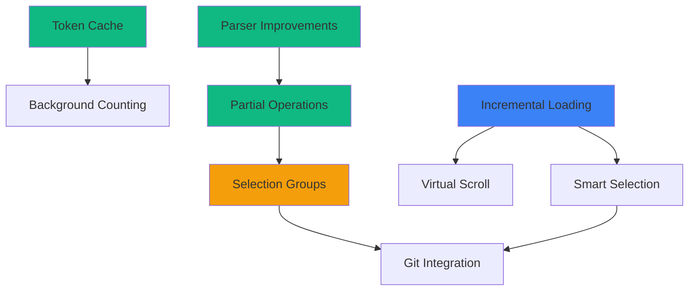

# Implementation Plan: Large Codebase Features

## Overview

This plan implements performance, usability, and reliability improvements for working with large codebases. The implementation is divided into 4 phases, prioritizing quick wins and foundational improvements first.

## Milestones

- [x] **M0: Analysis & Design** (Completed)
  - Requirements gathering
  - Architecture design
  - API design

- [ ] **M1: Foundation** (Target: Week 1-2)
  - Token cache infrastructure
  - Improved error handling
  - Basic fallback mechanisms

- [ ] **M2: Performance** (Target: Week 3-4)
  - Incremental tree loading
  - Partial operations execution
  - Memory monitoring

- [ ] **M3: Usability** (Target: Week 5-6)
  - Selection groups
  - Smart selection tools
  - Enhanced UI feedback

- [ ] **M4: Advanced Features** (Target: Week 7-8)
  - Git integration
  - Advanced search
  - Analytics dashboard

## Phase 1: Foundation (Quick Wins)

**Goal:** Improve reliability and add caching without breaking changes

### Task 1.1: Token Cache Infrastructure
**Priority:** HIGH | **Effort:** 3 days | **Risk:** LOW

**Subtasks:**
- [ ] Create `services/token_cache.py`
  - [ ] Define `TokenCacheManager` class
  - [ ] Implement SQLite database schema
  - [ ] Add CRUD operations (get, set, invalidate)
  - [ ] Add cache size management
  - [ ] Add JSON fallback

- [ ] Update `core/token_counter.py`
  - [ ] Integrate cache lookups before counting
  - [ ] Store results in cache after counting
  - [ ] Add hash calculation for cache keys

- [ ] Add cache settings to UI
  - [ ] Enable/disable cache toggle
  - [ ] Cache size limit setting
  - [ ] Clear cache button

**Acceptance Criteria:**
- ✅ Cache hit reduces count time from 100ms → 5ms
- ✅ Cache persists across app restarts
- ✅ Cache auto-invalidates on file changes
- ✅ Cache size stays under configured limit

**Tests:**
- Unit tests for cache CRUD
- Integration test: count same files twice
- Performance test: 1000 file count with cache
- Error test: corrupted database recovery

---

### Task 1.2: Improved OPX Parser Error Handling
**Priority:** HIGH | **Effort:** 2 days | **Risk:** LOW

**Subtasks:**
- [ ] Update `core/opx_parser.py`
  - [ ] Continue parsing after individual errors
  - [ ] Collect errors instead of raising immediately
  - [ ] Return partial results with error list
  - [ ] Add error recovery hints

- [ ] Update `views/apply_view.py`
  - [ ] Display partial parse results
  - [ ] Show errors with line numbers
  - [ ] Allow user to fix and re-parse

**Acceptance Criteria:**
- ✅ Parser returns partial results on errors
- ✅ All errors collected and reported
- ✅ User can see which edits failed and why

**Tests:**
- Parse OPX with 1 invalid edit among 10
- Parse OPX with missing required attributes
- Parse OPX with malformed XML

---

### Task 1.3: Partial Operations Execution
**Priority:** HIGH | **Effort:** 3 days | **Risk:** MEDIUM

**Subtasks:**
- [ ] Create `services/operations_executor.py`
  - [ ] Define `PartialOperationsExecutor` class
  - [ ] Implement independent file execution
  - [ ] Add retry logic with exponential backoff
  - [ ] Track results per operation

- [ ] Update `core/file_actions.py`
  - [ ] Make each operation independent
  - [ ] Add per-file backup before changes
  - [ ] Add rollback on failure

- [ ] Update `views/apply_view.py`
  - [ ] Show real-time progress per file
  - [ ] Display success/failure indicators
  - [ ] Add retry button for failed operations
  - [ ] Show summary stats (X/Y succeeded)

**Acceptance Criteria:**
- ✅ Failed operations don't stop others
- ✅ Each file has backup before changes
- ✅ Automatic rollback on failure
- ✅ Clear per-file status reporting

**Tests:**
- Apply 10 operations with 2 failures
- Test retry logic with transient errors
- Test backup and rollback
- Test permission error handling

---

### Task 1.4: Memory Monitoring Enhancements
**Priority:** MEDIUM | **Effort:** 1 day | **Risk:** LOW

**Subtasks:**
- [ ] Update `services/memory_monitor.py`
  - [ ] Add memory pressure detection
  - [ ] Add auto-cleanup triggers
  - [ ] Add warning/critical thresholds

- [ ] Add memory-aware behaviors
  - [ ] Clear token cache when memory high
  - [ ] Disable features under pressure
  - [ ] Show warnings to user

**Acceptance Criteria:**
- ✅ Detect when memory > 800MB
- ✅ Auto-clear caches to free memory
- ✅ Prevent crashes from OOM

**Tests:**
- Simulate high memory usage
- Test cache clearing
- Test feature degradation

---

## Phase 2: Performance (Core Improvements)

**Goal:** Handle large projects (10,000+ files) efficiently

### Task 2.1: Incremental Tree Loading
**Priority:** HIGH | **Effort:** 5 days | **Risk:** HIGH

**Subtasks:**
- [ ] Create `services/incremental_tree_loader.py`
  - [ ] Define `IncrementalTreeLoader` class
  - [ ] Implement top-level quick scan
  - [ ] Implement lazy folder loading
  - [ ] Add background full tree loading
  - [ ] Add cancellation support

- [ ] Update `components/file_tree.py`
  - [ ] Integrate incremental loader
  - [ ] Show loading indicators
  - [ ] Load folders on expand
  - [ ] Handle load errors gracefully

- [ ] Add tree load cache
  - [ ] Cache tree structure
  - [ ] Invalidate on file system changes
  - [ ] Store in session state

**Acceptance Criteria:**
- ✅ Top-level visible within 500ms
- ✅ Folders load on-demand in < 100ms
- ✅ UI remains responsive during loading
- ✅ Can cancel long loads

**Tests:**
- Load 50,000 file project
- Measure initial render time
- Test folder expansion performance
- Test cancellation

---

### Task 2.2: Virtual Scrolling for Large Trees
**Priority:** MEDIUM | **Effort:** 3 days | **Risk:** MEDIUM

**Subtasks:**
- [ ] Update `components/file_tree.py`
  - [ ] Implement virtual scroll container
  - [ ] Render only visible rows
  - [ ] Add scrollbar with position tracking
  - [ ] Maintain selection state

**Acceptance Criteria:**
- ✅ Smooth scrolling with 10,000 files
- ✅ Memory usage independent of file count
- ✅ Selection works correctly

**Tests:**
- Render 10,000 file tree
- Measure memory usage
- Test scrolling performance

---

### Task 2.3: Background Token Counting
**Priority:** MEDIUM | **Effort:** 2 days | **Risk:** LOW

**Subtasks:**
- [ ] Update `services/token_display.py`
  - [ ] Move counting to background thread
  - [ ] Add progress callbacks
  - [ ] Add cancellation support
  - [ ] Queue multiple count requests

- [ ] Update UI to show progress
  - [ ] Progress bar for counting
  - [ ] Incremental updates (count/total)
  - [ ] Cancel button

**Acceptance Criteria:**
- ✅ UI responsive during counting
- ✅ Progress visible to user
- ✅ Can cancel long counts

**Tests:**
- Count 1000 files
- Test cancellation
- Test concurrent count requests

---

## Phase 3: Usability (User Experience)

**Goal:** Make file selection and management much faster

### Task 3.1: Selection Groups
**Priority:** HIGH | **Effort:** 4 days | **Risk:** LOW

**Subtasks:**
- [ ] Create `services/selection_groups.py`
  - [ ] Define `SelectionGroupManager` class
  - [ ] Implement CRUD operations
  - [ ] Add import/export (.owg format)
  - [ ] Add validation

- [ ] Update `views/context_view.py`
  - [ ] Add "Groups" dropdown
  - [ ] Add "Save Selection As Group" button
  - [ ] Add "Load Group" button
  - [ ] Show active group name

- [ ] Add group management dialog
  - [ ] List all groups
  - [ ] Edit group name/description
  - [ ] Delete groups
  - [ ] Import/export groups

**Acceptance Criteria:**
- ✅ Can save current selection as group
- ✅ Can load group to restore selection
- ✅ Groups persist in project
- ✅ Can export/import groups

**Tests:**
- Create, load, delete group
- Test persistence across restarts
- Test import/export
- Test validation

---

### Task 3.2: Smart Selection Tools
**Priority:** HIGH | **Effort:** 4 days | **Risk:** MEDIUM

**Subtasks:**
- [ ] Create `services/smart_selection.py`
  - [ ] Define `SmartSelectionEngine` class
  - [ ] Implement glob pattern matching
  - [ ] Implement regex matching
  - [ ] Implement git status filtering
  - [ ] Implement metadata filtering

- [ ] Add "Select by Pattern" dialog
  - [ ] Pattern input field (glob/regex)
  - [ ] Preview matching files
  - [ ] Apply/cancel buttons
  - [ ] Recent patterns history

- [ ] Add "Select by Git Status" menu
  - [ ] Modified files
  - [ ] Untracked files
  - [ ] Staged files
  - [ ] All changed files

**Acceptance Criteria:**
- ✅ Can select by glob pattern
- ✅ Preview shows matching files
- ✅ Git status selection works
- ✅ Fast for large projects (< 500ms)

**Tests:**
- Select by pattern "**/*.test.ts"
- Select modified files
- Test performance with 10,000 files
- Test invalid patterns

---

### Task 3.3: Enhanced UI Feedback
**Priority:** MEDIUM | **Effort:** 2 days | **Risk:** LOW

**Subtasks:**
- [ ] Add progress indicators
  - [ ] Tree loading progress
  - [ ] Token counting progress
  - [ ] Operation execution progress

- [ ] Add status messages
  - [ ] Success messages with auto-hide
  - [ ] Error messages with details
  - [ ] Warning messages

- [ ] Add keyboard shortcuts help
  - [ ] Help dialog with all shortcuts
  - [ ] Shortcut hints in UI

**Acceptance Criteria:**
- ✅ All long operations show progress
- ✅ Clear feedback for all actions
- ✅ Keyboard shortcuts discoverable

---

## Phase 4: Advanced Features (Optional)

**Goal:** Power user features and analytics

### Task 4.1: Git Integration
**Priority:** MEDIUM | **Effort:** 3 days | **Risk:** MEDIUM

**Subtasks:**
- [ ] Add `pygit2` dependency
- [ ] Create `services/git_integration.py`
  - [ ] Detect git repository
  - [ ] Query file status
  - [ ] Get diff for files
  - [ ] List branches

- [ ] Add git features to UI
  - [ ] Show git status icons
  - [ ] "Select Modified" button
  - [ ] View diff before selecting

**Acceptance Criteria:**
- ✅ Detects git repos
- ✅ Shows file git status
- ✅ Quick select by status

**Tests:**
- Test on git repo
- Test on non-git folder
- Test performance

---

### Task 4.2: Advanced Search
**Priority:** LOW | **Effort:** 3 days | **Risk:** LOW

**Subtasks:**
- [ ] Add content search using `ripgrep`
- [ ] Add combined filters UI
- [ ] Add saved search patterns

**Acceptance Criteria:**
- ✅ Can search file contents
- ✅ Fast results (< 1s)
- ✅ Can save common searches

---

### Task 4.3: Analytics Dashboard
**Priority:** LOW | **Effort:** 2 days | **Risk:** LOW

**Subtasks:**
- [ ] Create analytics view
- [ ] Show usage statistics
- [ ] Show performance metrics
- [ ] Export analytics data

**Acceptance Criteria:**
- ✅ View usage patterns
- ✅ Monitor performance
- ✅ Export for analysis

---

## Task Dependencies



**Critical Path:**
1. Incremental Tree Loading (T21) - Blocks virtual scroll and smart selection
2. Partial Operations (T13) - Required for reliability
3. Token Cache (T11) - Foundation for performance

## Timeline & Estimates

### Week 1-2: Foundation Phase
| Task | Days | Status |
|------|------|--------|
| Token Cache | 3 | ⏳ Not started |
| Parser Improvements | 2 | ⏳ Not started |
| Partial Operations | 3 | ⏳ Not started |
| Memory Monitoring | 1 | ⏳ Not started |
| **Total** | **9 days** | |

### Week 3-4: Performance Phase
| Task | Days | Status |
|------|------|--------|
| Incremental Loading | 5 | ⏳ Not started |
| Virtual Scrolling | 3 | ⏳ Not started |
| Background Counting | 2 | ⏳ Not started |
| **Total** | **10 days** | |

### Week 5-6: Usability Phase
| Task | Days | Status |
|------|------|--------|
| Selection Groups | 4 | ⏳ Not started |
| Smart Selection | 4 | ⏳ Not started |
| UI Feedback | 2 | ⏳ Not started |
| **Total** | **10 days** | |

### Week 7-8: Advanced Features (Optional)
| Task | Days | Status |
|------|------|--------|
| Git Integration | 3 | ⏳ Not started |
| Advanced Search | 3 | ⏳ Not started |
| Analytics | 2 | ⏳ Not started |
| **Total** | **8 days** | |

**Total Estimated Effort:** 37 days (7.4 weeks)

## Risks & Mitigation

### Technical Risks

| Risk | Impact | Probability | Mitigation |
|------|--------|-------------|------------|
| **Incremental loading breaks UI** | HIGH | MEDIUM | Extensive testing, feature flag |
| **SQLite performance issues** | MEDIUM | LOW | Benchmark early, JSON fallback |
| **Memory leaks in background threads** | HIGH | MEDIUM | Careful resource management, testing |
| **Git integration adds dependency** | LOW | HIGH | Make it optional, graceful fallback |
| **Virtual scroll too complex** | MEDIUM | MEDIUM | Use proven library or simplify |

### Resource Risks

| Risk | Impact | Probability | Mitigation |
|------|--------|-------------|------------|
| **Scope creep (too many features)** | HIGH | HIGH | Strict phase gates, MVP focus |
| **Testing takes longer than dev** | MEDIUM | MEDIUM | TDD approach, automated tests |
| **User resistance to changes** | MEDIUM | LOW | Beta testing, feature flags |

### Dependency Risks

| Risk | Impact | Probability | Mitigation |
|------|--------|-------------|------------|
| **Flet framework limitations** | HIGH | LOW | Prototype early, backup plan |
| **pygit2 compatibility issues** | LOW | MEDIUM | Use subprocess fallback |
| **Breaking changes in dependencies** | MEDIUM | LOW | Pin versions, test upgrades |

## Resources Needed

### Development
- 1 Full-stack developer (Python + Flet)
- Access to large test repositories (10,000+ files)
- Performance profiling tools

### Testing
- Pytest for unit/integration tests
- Performance testing framework
- Beta testers with large projects

### Infrastructure
- CI/CD for automated testing
- Code coverage tools
- Performance monitoring

### Documentation
- Technical documentation for APIs
- User documentation for new features
- Migration guides

## Success Metrics

### Phase 1: Foundation
- ✅ Cache hit rate > 70% after warmup
- ✅ Zero crashes from parser errors
- ✅ 95% operation success rate

### Phase 2: Performance
- ✅ Tree load time < 1s for any project
- ✅ Memory usage < 300MB for 10,000 files
- ✅ UI responsive during all operations

### Phase 3: Usability
- ✅ File selection time reduced by 80%
- ✅ Users report improved productivity
- ✅ Positive user feedback on groups

### Phase 4: Advanced
- ✅ Git features used by > 50% of users
- ✅ Advanced search queries perform well
- ✅ Analytics provide actionable insights

## Rollout Strategy

### Phase 1: Alpha (Internal Testing)
- Deploy to development team
- Gather feedback on core features
- Fix critical bugs
- **Duration:** 1 week

### Phase 2: Beta (Selected Users)
- Deploy to volunteers with large projects
- Monitor performance metrics
- Collect usability feedback
- **Duration:** 2 weeks

### Phase 3: General Availability
- Release to all users
- Gradual feature enablement
- Monitor error rates
- **Duration:** Ongoing

### Feature Flags

Enable features progressively:

```python
FEATURES = {
    "token_cache": True,  # Always on
    "incremental_loading": True,  # Default on for large projects
    "virtual_scroll": False,  # Opt-in initially
    "selection_groups": True,  # Always on
    "smart_selection": True,  # Always on
    "git_integration": False,  # Opt-in, requires pygit2
    "advanced_search": False,  # Opt-in, requires ripgrep
}
```

## Post-Launch

### Monitoring
- Track feature usage
- Monitor performance metrics
- Collect error reports
- Survey user satisfaction

### Maintenance
- Bug fixes based on reports
- Performance tuning
- Documentation updates
- Security patches

### Future Enhancements
- Team collaboration features
- Cloud sync for groups
- AI-powered file selection
- Custom plugins system

## Appendix: Implementation Guidelines

### Code Style
- Follow existing Python conventions
- Use type hints for all functions
- Write docstrings for classes/methods
- Keep functions < 50 lines

### Testing Requirements
- Unit tests for all new functions
- Integration tests for workflows
- Performance tests for critical paths
- Error scenario tests

### Documentation Standards
- API documentation in code
- User-facing documentation in docs/
- Architecture decisions recorded
- Migration guides for breaking changes

### Review Process
1. Self-review and testing
2. Code review by peer
3. Testing on target platforms
4. Documentation review
5. Merge to main branch
