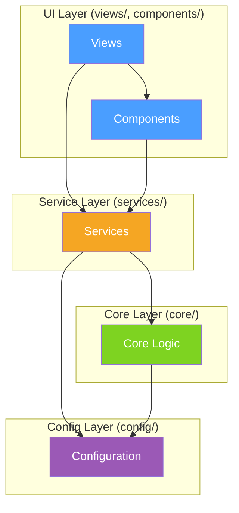

# Synapse Desktop - Target Architecture

## 1. Overview

Synapse Desktop is a Python + PySide6 desktop application for building LLM prompts from code workspaces. This document defines the target architecture after refactoring.

### Product Features
- File/folder selection with tree view, ignore/gitignore support
- Token counting per model tokenizer
- Prompt generation in XML/JSON/Plain/Markdown formats
- Smart Context: tree-sitter signature + relationship extraction
- Git diff/log integration
- Security scan for secrets before copy
- OPX edit application with history/session

---

## 2. Layering & Dependency Rules



### Dependency Rules (non-negotiable)
| Rule | Description |
|------|-------------|
| **R1** | `core/` MUST NOT import from `services/`, `views/`, `components/` |
| **R2** | `core/` MUST NOT import Qt (`PySide6`) |
| **R3** | `core/` MUST NOT read settings directly; receives config via parameters or interfaces |
| **R4** | `services/` MAY import from `core/` and `config/` |
| **R5** | `views/` and `components/` MAY import from `services/` and `config/` |
| **R6** | `views/` and `components/` SHOULD NOT call deep `core/` internals directly |

---

## 3. Module Map (Target State)

### 3.1 `core/prompting/` - Prompt Pipeline

```
core/prompting/
  __init__.py
  types.py              # OutputStyle, PromptConfig dataclasses
  path_utils.py         # path_for_display() - single source of truth
  file_collector.py     # Filter selected paths, read file content, binary detection
  formatters/
    __init__.py
    base.py             # Protocol/ABC: Formatter.format(files, options) -> str
    xml_formatter.py    # Repomix XML format
    json_formatter.py   # JSON format
    plain_formatter.py  # Plain text format
    markdown_formatter.py  # Markdown code blocks format
  prompt_assembler.py   # Assemble sections: summary + map + contents + instructions + git
  smart_context.py      # Re-export from core/smart_context (unchanged)
```

**Key interfaces:**
```python
# core/prompting/types.py
@dataclass
class FileEntry:
    path: str
    display_path: str
    content: str
    language: str

@dataclass
class PromptConfig:
    output_style: OutputStyle
    use_relative_paths: bool = True
    include_git: bool = False
    max_file_size: int = 1024 * 1024
    workspace_root: Optional[Path] = None

# core/prompting/formatters/base.py
class Formatter(Protocol):
    def format(self, files: list[FileEntry], config: PromptConfig) -> str: ...
```

### 3.2 `core/ignore/` - Unified Ignore Engine

```
core/ignore/
  __init__.py
  engine.py       # IgnoreEngine class - single source of truth
  patterns.py     # EXTENDED_IGNORE_PATTERNS constant (moved from file_utils)
```

**Key interface:**
```python
# core/ignore/engine.py
class IgnoreEngine:
    def __init__(self, root_path: Path, excluded_patterns: list[str],
                 use_gitignore: bool, use_default_ignores: bool): ...

    def should_ignore(self, abs_path: Path, rel_path: str) -> bool: ...
    def get_pathspec(self) -> pathspec.PathSpec: ...  # Cached by root + mtime
    def invalidate_cache(self): ...
```

**Consumers (all use IgnoreEngine instead of building own pathspec):**
- `core/utils/file_utils.py` (scan_directory, scan_directory_shallow)
- `core/utils/file_scanner.py` (FileScanner)
- `components/file_tree_model.py` (_collect_files_from_disk)

### 3.3 `core/tokenization/` - Token Counting

```
core/tokenization/
  __init__.py
  types.py          # TokenCountResult, TokenConfig dataclasses
  counter.py        # count_tokens(), count_tokens_for_file() - pure logic
  cache.py          # TokenCache with mtime-based invalidation
  encoder_registry.py  # Encoder selection (rs_bpe/tiktoken/hf) - NO settings import
  batch.py          # Parallel/batch processing (ThreadPoolExecutor, encode_batch)
```

**Key changes:**
- `encoder_registry.py` receives `model_id` and `tokenizer_repo` as parameters (DIP)
- `cache.py` has explicit `invalidate(path)` and `clear()` methods
- `batch.py` handles parallel coordination

### 3.4 `services/token_count_service.py` - Token Orchestration

```python
# services/token_count_service.py
class TokenCountService:
    """Facade: scheduling, cancellation, UI updates.
    UI/Model calls this, NEVER core.tokenization directly."""

    def __init__(self, on_update: Callable): ...
    def count_for_files(self, paths: list[str]) -> dict[str, int]: ...
    def count_batch_async(self, paths: list[str], callback): ...
    def cancel(self): ...
    def clear_cache(self): ...
    def invalidate(self, path: str): ...
```

### 3.5 `services/workspace_index.py` - Tree Data Separation

```python
# services/workspace_index.py
class WorkspaceIndex:
    """Pure data: tree building, search index, file listing.
    No Qt dependency."""

    def build_tree(self, path: Path, config: ScanConfig) -> TreeItem: ...
    def build_search_index(self, path: Path) -> list[str]: ...
    def search(self, query: str) -> list[str]: ...
    def collect_files_deep(self, node: TreeItem, ...) -> list[str]: ...
```

**`components/file_tree_model.py` after refactoring only handles:**
- Qt roles mapping (TreeNode -> QModelIndex)
- Selection state (checked/unchecked/partial)
- canFetchMore/fetchMore via WorkspaceIndex
- dataChanged signals

---

## 4. Naming & Placement Conventions

| Category | Location | Naming |
|----------|----------|--------|
| Pure domain logic | `core/` | lowercase_snake_case modules |
| Domain sub-packages | `core/{feature}/` | e.g., `core/prompting/`, `core/tokenization/` |
| I/O, scheduling, state | `services/` | `*_service.py` for facades |
| Qt widgets | `components/` | `*_widget.py`, `*_model.py`, `*_delegate.py` |
| Qt views (tabs) | `views/` | `*_view_qt.py` |
| App configuration | `config/` | `*_config.py` |
| Dataclasses/types | `*/types.py` | Grouped by domain |
| Interfaces/protocols | In same module or `base.py` | `Protocol` or `ABC` |

---

## 5. Thread Safety Rules

| Component | Thread Model | Constraint |
|-----------|-------------|------------|
| Token counting | ThreadPoolExecutor | Workers use thread-local; no shared mutable state |
| File watcher | QFileSystemWatcher | Signals to main thread only |
| Search index | Background QRunnable | Generation-based staleness check |
| Smart context | ThreadPoolExecutor | Stateless per-file processing |
| Cache access | threading.Lock | All cache writes go through Lock |

---

## 6. Error Handling & Logging

- All modules use `core/logging_config.py` (existing)
- File I/O errors: return default value (0 tokens, empty content), log warning
- Encoder failure: fallback to estimate (4 chars = 1 token)
- No silent swallowing of exceptions in new code

---

## 7. Backward Compatibility

During refactoring:
1. Old public APIs get thin adapter wrappers that delegate to new modules
2. Adapters are marked `# DEPRECATED: Use core.prompting.X instead`
3. Adapters are removed only after all call sites are migrated
4. `generate_prompt()` signature remains stable throughout

