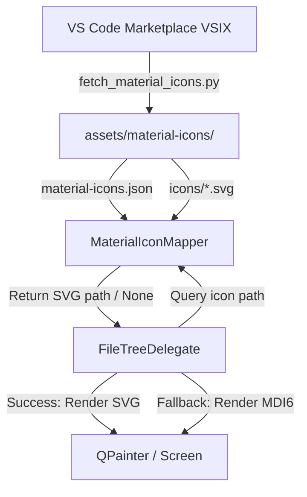

# Design Specification: VS Code Material Icon Theme Integration

Integrate the official VS Code Material Icon Theme into Synapse Desktop's file tree explorer to provide a rich, modern, and professional visual representation of workspace files and folders.

## Overview

Currently, Synapse Desktop uses generic, font-based Material Design Icons (`mdi6` via `qtawesome`) to represent files and folders in the file tree. While functional, it lacks visual distinction for specific folder structures (e.g. `src`, `tests`, `.github`) and branded languages (e.g. Python, JS, TS, HTML, CSS, Rust).

This specification proposes replacing the current icon system with the **VS Code Material Icon Theme** using a clean, automated approach:
1. A development-time script (`scripts/fetch_material_icons.py`) downloads the latest VSIX extension package from the VS Code Marketplace and extracts all SVG icons and its mapping JSON (`material-icons.json`).
2. These resources are ignored in Git via `.gitignore` to avoid repository bloat.
3. Build scripts automatically run the download script before building/packaging.
4. The file tree view delegate is updated to load `material-icons.json` and render the SVG icons dynamically using PySide6's `QSvgRenderer`.
5. A robust fallback mechanism preserves current font-based icons if the material-icons assets are not present.

---

## Proposed Architecture



---

## Detailed Implementation Plan

### 1. New Asset Downloader (`scripts/fetch_material_icons.py`)

A script to automate fetching the latest icons without committing 1000+ files to the repository.

- **Source URL:** `https://marketplace.visualstudio.com/_apis/public/gallery/publishers/PKief/vsextensions/material-icon-theme/latest/vspackage`
- **Output Directory:** `assets/material-icons/`
  - `assets/material-icons/material-icons.json` (contains mappings)
  - `assets/material-icons/icons/` (contains SVG files)
- **Behavior:**
  - Uses `requests` to download the VSIX.
  - Treats the VSIX as a ZIP file.
  - Extracts `extension/dist/material-icons.json` and all SVGs from `extension/icons/`.
  - Safely deletes temporary download files.
  - Skips downloading if the assets already exist (unless `--force` is passed).

### 2. Git Configuration (`.gitignore`)

Add the following rule to exclude download assets:
```text
assets/material-icons/
```

### 3. Build Scripts Integration

Both build scripts will run the download script if the directory is missing:
- **`build-windows.ps1`**: Add a step to check `Test-Path $ASSETS_DIR\material-icons` and execute `& $VENV_PYTHON scripts\fetch_material_icons.py` if not found.
- **`build-appimage.sh`**: Add a step to check `[ -d "$SCRIPT_DIR/assets/material-icons" ]` and execute `python3 scripts/fetch_material_icons.py` if not found.

### 4. File Tree Icon Mapper (`MaterialIconMapper` in `file_tree_delegate.py`)

A helper class that parses VS Code's icon definitions and maps filenames/extensions to local SVG paths.

- **Location:** Inside [file_tree_delegate.py](file:///d:/share_vm/Synapse-Desktop/presentation/components/file_tree/file_tree_delegate.py) or as a separate file imported by it.
- **Mapping Flow:**
  - Given a path's name, is it a directory or file?
  - **Directories:**
    - Look up lowercase directory name in `folderNamesExpanded` (if open) or `folderNames` (if closed).
    - Fallback to the default folder icon definition (`folderExpanded` or `folder`).
  - **Files:**
    - Look up lowercase filename in `fileNames` (e.g. `package.json`).
    - If not found, look up extension in `fileExtensions` (e.g. `py`, `js`).
    - Support multi-part extensions (e.g. `spec.js`).
    - Fallback to the default file icon definition (`file`).
  - Resolve definition name in `iconDefinitions` to get the relative SVG path, then prepend the absolute path to `assets/material-icons/`.

### 5. Render & Cache in `FileTreeDelegate`

- Update `paint` method in `FileTreeDelegate` to query `MaterialIconMapper`.
- Retrieve open/closed state of folders using `option.state & QStyle.StateFlag.State_Open`.
- If an SVG path is found:
  - Render it using `QSvgRenderer` onto a `QPixmap` of size `ICON_SIZE` (16x16).
  - Cache the resulting `QPixmap` using a static cache `_svg_icon_cache` to ensure smooth rendering and minimize CPU/disk I/O.
- If not enabled or mapping fails (fallback):
  - Fall back to original `qtawesome` rendering logic.

---

## Verification Plan

### Automated Verification
- Verify that `scripts/fetch_material_icons.py` executes successfully and downloads all files.
- Verify that unit tests still pass (no regressions in file tree state or widgets).

### Manual Verification
1. Run `python scripts/fetch_material_icons.py`.
2. Launch Synapse Desktop using `python main_window.py`.
3. Open a workspace and verify:
   - Python files (`.py`) display the blue/yellow Python snake icon.
   - Folders like `src`, `tests`, `.git` display their customized folder icons.
   - Folder icons change to their "open" version when expanded.
   - General files display the standard grey VS Code file icon.
4. Run `.\build-windows.ps1` and verify the packaged EXE bundles the icons and runs successfully with them.
